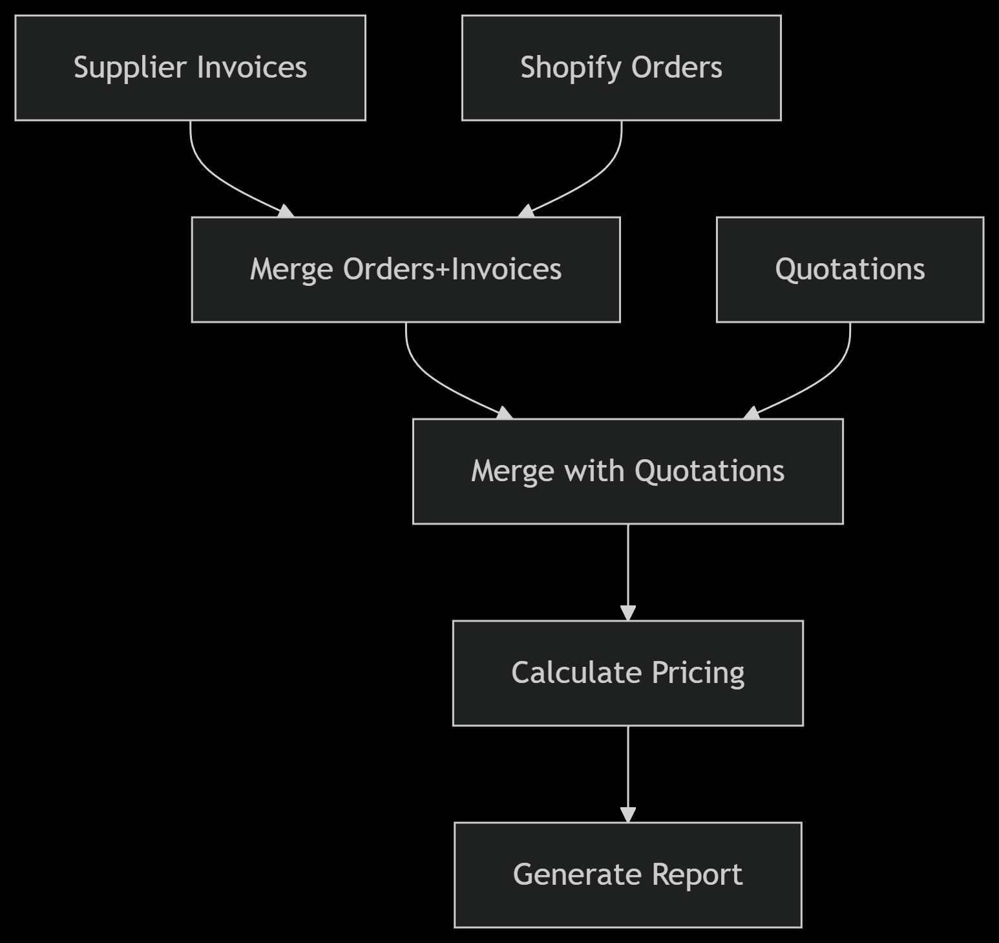

# 🧾 Flujo n8n: Validador de Facturas de Proveedores vs Shopify

  
*Flujo completo de validación de facturas*

## 🔄 Funcionamiento
1. **Entradas**:
   - Órdenes Shopify (`Order Number`, `Item SKU`, `Quantity`)
   - Cotizaciones (`Item SKU`, `Unit Price`)
   - Facturas proveedor (`Order Number`, `Item SKU`, `Charged Unit Price`, `Quantity`)

2. **Proceso**:
   - Cruza datos por SKU y número de orden
   - Calcula diferencias de precios
   - Clasifica como: `Overcharged`/`Undercharged`/`Correct`

3. **Salida**:
   - Reporte en Google Sheets con diferencias

## 🚀 Prueba el Flujo

### 📁 Datos de Ejemplo
Descarga el archivo modelo con datos de prueba:  
[Flow_Check_Supplier_Invoices_Prices.xlsx](Flow_Check_Supplier_Invoices_Prices.xlsx)

Contiene:
- 3 hojas pre-formateadas
- Datos de muestra para pruebas
- Estructura lista para importar

### Requisitos
- Instancia n8n (local/cloud)
- Google Sheets con las 3 hojas del archivo .xlsx
- Credenciales Google Sheets API (OAuth2)

### Configuración Rápida
1. **Importa el flujo**:
   - Descarga `flow_check_supplier_invoices.json`
   - En n8n: Workflows > Import

2. **Configura conexiones**:
   ```json
   {
     "documentId": "TU_ID_GOOGLE_SHEET",
     "sheetName": "NOMBRE_HOJA" // Usar nombres del .xlsx
   }
