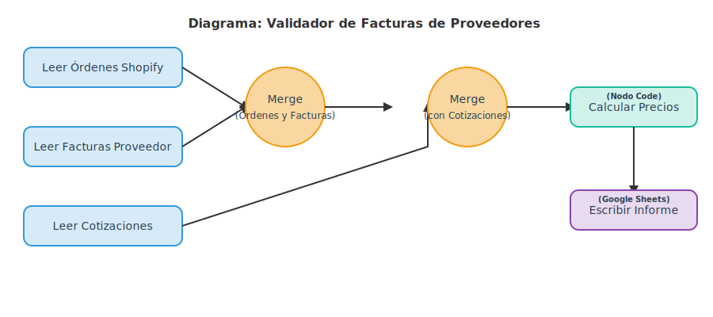

# n8n: Automatización para la Validación de Facturas de Proveedores

Este proyecto demuestra un flujo de trabajo avanzado en n8n diseñado para resolver un problema crítico en operaciones y finanzas: **la validación automática de los precios en las facturas de los proveedores contra las órdenes de compra y las cotizaciones acordadas.**

Este es un caso de uso de negocio real que ahorra horas de trabajo manual, previene pagos excesivos y proporciona una visibilidad clara sobre las discrepancias en la facturación.

## Diagrama del Flujo de Trabajo

La arquitectura del flujo está diseñada para leer, fusionar, calcular y reportar los datos de manera secuencial y lógica.

## Requerimiento del Proyecto (Caso de Negocio)

El objetivo es automatizar la conciliación de facturas de proveedores para un negocio de e-commerce. El flujo debe ser capaz de:

1.  **Consolidar Datos:** Leer y extraer información de tres fuentes de datos distintas (almacenadas en Google Sheets).
2.  **Procesar y Calcular:** Cruzar la información, usando el `Número de Orden` y el `SKU del Producto`, para calcular la diferencia monetaria de cada ítem.
3.  **Generar un Informe Accionable:** Clasificar cada ítem como `Overcharged`, `Undercharged` o `Correct` y escribir un informe detallado en una hoja de Google Sheets.

## Tecnologías y Componentes Clave

*   **n8n.io:** Plataforma de automatización que orquesta todo el flujo.
*   **Google Sheets:** Utilizado como base de datos para las entradas y la salida del informe.
*   **Nodos `Merge`:** Esenciales para combinar datos de diferentes fuentes (similar a un `JOIN` en SQL).
*   **Nodo `Code` (JavaScript):** El cerebro del flujo, donde se realiza la validación, los cálculos y la clasificación de cada línea de factura.

---

## Consideraciones para Pruebas

Para replicar y probar este flujo de trabajo, sigue estos pasos:

### 1. Prerrequisitos
*   Una instancia de n8n (local o en la nube).
*   Una cuenta de Google y credenciales de Google Sheets API (OAuth2) configuradas en n8n.
*   El archivo `.json` de este flujo (disponible en la carpeta `/flows`).

### 2. Estructura de Datos en Google Sheets
Crea una hoja de cálculo en Google con 4 pestañas. La estructura de columnas para cada pestaña debe ser la siguiente:

**Pestaña 1: `shopify_orders`**
| Order Number | Item SKU | Quantity |
|--------------|----------|----------|

**Pestaña 2: `quotations`**
| Item SKU | Unit Price |
|----------|------------|

**Pestaña 3: `supplier_invoices`**
| Order Number | Item SKU | Charged Unit Price | Quantity |
|--------------|----------|--------------------|----------|

**Pestaña 4: `report`**
_(Esta hoja debe estar vacía, solo con las cabeceras)_
| Order Number | Item SKU | Expected Price | Charged Price | Quantity | Status | Difference |
|--------------|----------|----------------|---------------|----------|--------|------------|

### 3. Conjunto de Datos de Prueba
Puedes usar este conjunto de 5 órdenes para poblar tus hojas y probar todos los escenarios:

**Hoja: `shopify_orders`**
| Order Number | Item SKU | Quantity |
|--------------|----------|----------|
| #1001        | PROD-001 | 50       |
| #1002        | PROD-002 | 30       |
| #1003        | PROD-003 | 20       |
| #1004        | PROD-004 | 100      |
| #1005        | PROD-005 | 15       |

**Hoja: `quotations`**
| Item SKU | Unit Price |
|----------|------------|
| PROD-001 | 8.00       |
| PROD-002 | 25.00      |
| PROD-003 | 42.50      |
| PROD-004 | 5.50       |
| PROD-005 | 38.00      |

**Hoja: `supplier_invoices`**
| Order Number | Item SKU | Charged Unit Price | Quantity |
|--------------|----------|--------------------|----------|
| #1001        | PROD-001 | 8.50               | 50       |  _(Cobro Excesivo)_
| #1002        | PROD-002 | 24.00              | 30       |  _(Cobro Insuficiente)_
| #1003        | PROD-003 | 42.50              | 20       |  _(Correcto)_
| #1004        | PROD-004 | 5.50               | 95       |  _(Cantidad Incorrecta)_
| #1005        | PROD-005 | 38.00              | 15       |  _(Correcto)_

### 4. Configuración en n8n
1.  **Importa el Flujo:** Sube el archivo `.json` a tu instancia de n8n.
2.  **Conecta los Nodos:** En cada uno de los 4 nodos de Google Sheets, deberás:
    *   Seleccionar tu credencial de Google.
    *   Reemplazar el `Document ID` por el ID de tu propia hoja de cálculo.
    *   Asegurarte de que el `Sheet Name` coincide con los nombres de las pestañas (`shopify_orders`, `quotations`, etc.).

Al ejecutar el flujo, la pestaña `report` se llenará con el análisis de las discrepancias.
